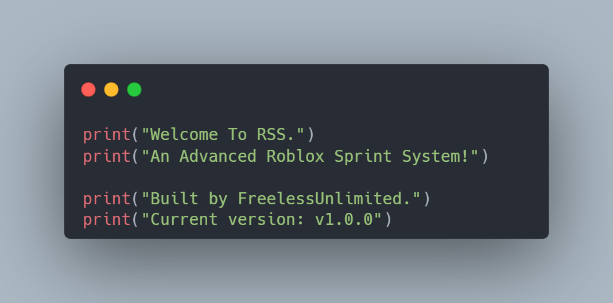

<p align="center"><a href="https://anuraghazra.github.io"></a></p>


A **modular, extensible sprint system** for Roblox that supports client-side, server-side, and hybrid authority modes. Features live configuration changes, optional animations, controller support, and a rich Public API for full external control.

---

## Table of Content

- [Features](#features)  
- [Installation](#installation)  
- [Configuration](#configuration)  
- [How To Use](#how-to-use)  
- [Public API](#public-api)  
- [Examples](#examples)  
- [License](#license)  

---

## Features

- Client-side, Server-side, and Hybrid authority support  
- Optional sprint animation support  
- Keyboard and controller input support  
- Live runtime configuration changes  
- Full external API for other scripts (speed override, forced sprint, multipliers)  
- Safe, modular, and production-ready  

---

## Installation

1. Add `SprintModule` to your project:

```
StarterPlayer
└─ StarterPlayerScripts
   └─ SprintController
      └─ SprintModule
```

2. Inside `SprintModule`, add a `Configuration` folder with:

- `Walk Speed` (NumberValue)  
- `Run Speed` (NumberValue)  
- `AnimationID` (StringValue, optional, leave empty to disable animation)

3. Require and instantiate the module in a controller LocalScript when the player’s character loads:

```lua
local SprintModule = require(script.SprintModule)
local sprint = SprintModule.new(player.Character)
```

---

## Configuration
- **Client** → Cosmetic only  
- **Server** → Authoritative speed control  
- **Hybrid** → Client requests, server applies  

---

## How To Use

### Creating a Sprint Instance

```lua
local SprintModule = require(path.to.SprintModule)
local sprint = SprintModule.new(character)
```

### Starting or Stopping Sprint

```lua
sprint:Start()
sprint:Stop()
```

### Force Sprint or Apply Effects

```lua
sprint:SetForcedSprint(true)
sprint:SetSpeedMultiplier(0.5)
```

### Restore Default Movement

```lua
sprint:ClearSpeedOverride()
sprint:ResetSpeedMultiplier()
sprint:SetForcedSprint(false)
```

### Authority Mode

```lua
SprintModule.Authority = "Client" -- Client | Server | Hybrid
```

You can find what **Authority** does in the [Configuration Section](#configuration)

### Animation Support

Leave `AnimationID` empty to disable animations.
And to change during runtime:

```lua
sprint:SetAnimation("rbxassetid://YOUR_ANIMATION_ID")
```

---

## Public API

### Queries

```lua
sprint:IsSprinting()        -- Returns boolean
sprint:GetCurrentSpeed()    -- Returns current humanoid WalkSpeed
```

### Sprint Control

```lua
sprint:Start()
sprint:Stop()
sprint:SetForcedSprint(boolean)
```

### Speed Control

```lua
sprint:SetWalkSpeed(number)
sprint:SetSprintSpeed(number)

sprint:SetSpeedOverride(number)
sprint:ClearSpeedOverride()

sprint:SetSpeedMultiplier(number)
sprint:ResetSpeedMultiplier()
```

### Animation Control

```lua
sprint:SetAnimation("rbxassetid://123456789")
```

### Lifecycle

```lua
sprint:Destroy()
```

---

## Examples

### Slowing Player Down (Debuff)

```lua
sprint:SetSpeedMultiplier(0.4)
```

### Require Sprint (Cutscene / Chase)

```lua
sprint:SetForcedSprint(true)
```

### Stun Player

```lua
sprint:SetSpeedOverride(0)
```

### Restore Normal Movement

```lua
sprint:ClearSpeedOverride()
sprint:ResetSpeedMultiplier()
sprint:SetForcedSprint(false)
```
